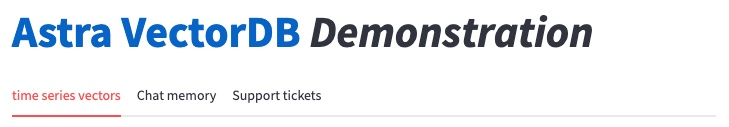

# DataStax VectorDB demonstration
The goal of this project is to provide a simple demonstration of the capabilities of AstraDB as it related to its [vector database and search functionality](https://www.datastax.com/blog/introducing-vector-search-empowering-cassandra-astra-db-developers-to-build-generative-ai-applications), Hybrid Search, langchain integration for agent memory, [index Analyzers](https://docs.datastax.com/en/astra-serverless/docs/vector-search/using-analyzers.html), [Storage Attached Index (SAI)](https://docs.datastax.com/en/cql/astra/docs/developing/indexing/sai/sai-overview.html) for vector search filtering. 

These capabilities are used for a vectorization of time series and support tickets for root cause analsyis based on available research papers. 

Below is the screenshot of the demo. 



## Building

It is recommended to create a python virtual environment using your tool of choice before installing the dependencies. The steps below are based on the virtual environment tool [venv](https://docs.python.org/3/library/venv.html). 

```
python -m venv .venv
pip install -r requirements.txt
```

## Running
This application is built using [streamlit](https://streamlit.io/)

```
streamlit run app.py
```

## Credits

* [Samuel Matioli - astra-agent-memory repo](https://github.com/smatiolids/astra-agent-memory)
* Radovan Zvoncek work on Time Series Forecasting with Astra
 